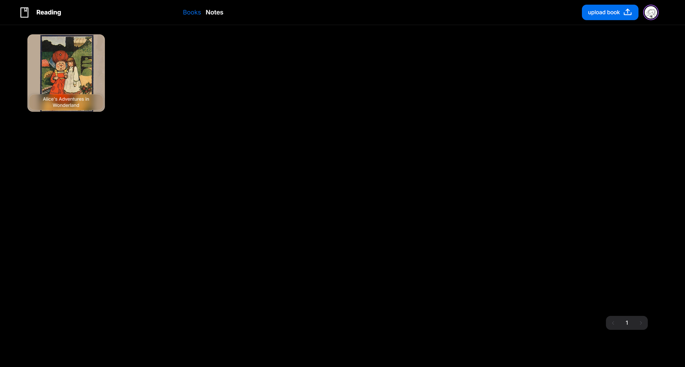

<h3 align="center">Reading</h3>

<h3 align="center"></h3>

## memory card

Remembering things through the Ebbinghaus curve

## Getting Started

### Prepare environment variables

```bash
git clone git@github.com:lalaze/memory.git
cd memory
cp .env.example .env.local
```
Modify environmental parameters according to actual needs

### Local Development

repare your MongoDB URI and modify the environment variables

```bash
npm install
npm run dev
```

### docker

```bash
docker compose up -d # have mongodb
docker compose -f docker-compose-noM.yaml up -d # your mongodb
```
